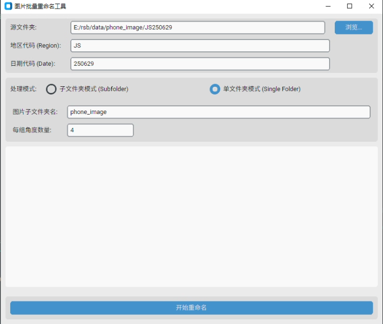

# 图片批量重命名工具 (Image Batch Renaming Tool)

[](https://www.python.org/)
[](https://opensource.org/licenses/MIT)

一个强大且易用的 Python 脚本，用于根据特定规则批量重命名并复制图片文件。该工具提供了两种操作模式，并支持**图形用户界面 (GUI)** 和**命令行**两种使用方式，以满足不同用户的需求。

  

---

## ✨ 主要特性

* **双模式操作**：
    1.  **子文件夹模式 (Subfolder Mode)**: 自动处理分散在多个子文件夹中的图片组。
    2.  **单文件夹模式 (Single Folder Mode)**: 通过识别特定格式的“引导图” (`...-XX.jpg`)，智能地对存放在单个文件夹中的大量图片进行分组和重命名。
* **双重使用方式**：
    * **图形用户界面 (GUI)**: 提供一个直观、现代的界面，通过点击和输入即可完成所有操作，无需记忆任何命令。
    * **命令行 (CLI)**: 保留原始的命令行脚本，方便高级用户或在自动化流程中集成使用。
* **高度可定制**：无论是地区、日期前缀，还是分组的角度数量，都可以轻松自定义。
* **安全可靠**：脚本通过复制文件到新的 `renamed` 文件夹来进行操作，**不会修改任何原始文件**，确保您的原数据安全。
* **跨平台**：基于 Python 和 CustomTkinter 构建，可在 Windows, macOS 和 Linux 上运行。

---

## 🚀 安装与运行

### 1. 克隆仓库

首先，将本仓库克隆到您的本地电脑：

```bash
git clone [https://github.com/cyankirin99/manager.git](https://github.com/cyankirin99/manager.git)
cd manager
```

### 2. 安装依赖

本项目依赖 `customtkinter` 库来驱动 GUI。使用 `pip` 来安装所有必需的依赖项：

```bash
pip install -r requirements.txt
```

### 3. 运行程序

#### 方式一：使用图形用户界面 (推荐)

直接运行 `rename_images_gui.py` 脚本即可启动应用程序：

```bash
python rename_images_gui.py
```

**操作步骤**:
1.  点击 **“浏览...”** 按钮选择您的源文件夹 (例如 `HR250701`)。程序会自动尝试从文件夹名称中提取地区和日期代码。
2.  确认 **地区代码** 和 **日期代码** 是否正确。
3.  选择适合您文件结构的 **处理模式** (`子文件夹模式` 或 `单文件夹模式`)。
    * 如果选择 **单文件夹模式**，请确保下方的 **图片子文件夹名** 和 **每组角度数量** 设置正确。
4.  点击 **“开始重命名”** 按钮。
5.  处理过程和结果将实时显示在下方的日志框中。

---

#### 方式二：使用命令行

对于高级用户，您依然可以使用原始的 `rename_images.py` 脚本。

**通用参数**:
* `--region`: **(必需)** 地区代码 (2个字符, 例如: `HR`, `SY`)。
* `--date`: **(必需)** 日期代码 (6个字符, 例如: `250701`)。
* `--mode`: **(必需)** 选择模式: `subfolder` 或 `single_folder`。
* `--source_dir`: (可选) 指定基础源目录。如果留空，则默认为 `./{REGION}{DATE}`。

**`single_folder` 模式专属参数**:
* `--image_folder`: (可选) 包含所有图片的子文件夹名，默认为 `phone_image`。
* `--angle_num`: (可选) 指定每个小组的角度数量，默认为 `4`。

**使用示例**:

* **示例 1: 子文件夹模式**
    ```bash
    python rename_images.py --region HR --date 250701 --mode subfolder
    ```

* **示例 2: 单文件夹模式 (4个角度)**
    ```bash
    python rename_images.py --region SY --date 250623 --mode single_folder --angle_num 4
    ```

* **示例 3: 单文件夹模式 (3个角度，并指定源目录)**
    ```bash
    python rename_images.py --region SY --date 250623 --mode single_folder --angle_num 3 --source_dir /path/to/your/data
    ```
---

## 📁 文件结构说明

### 子文件夹模式 (subfolder)

此模式适用于以下文件结构：

```
HR250701/
├── 0001/
│   ├── image_01.jpg
│   ├── image_02.jpg
│   ├── image_03.jpg
│   └── image_04.jpg
├── 0002/
│   ├── pic_a.png
│   ├── pic_b.png
│   ├── pic_c.png
│   └── pic_d.png
...
```
处理后，`HR250701/renamed/` 文件夹中将生成 `HR-250701-0001-A.jpg`, `HR-250701-0001-B.jpg`... 等文件。

### 单文件夹模式 (single_folder)

此模式适用于所有图片和“引导图”都在同一个文件夹内的情况：

```
SY250623/
└── phone_image/
    ├── IMG_001-01.jpg  (引导图1)
    ├── product_1_front.jpg
    ├── product_1_side.jpg
    ├── product_1_top.jpg
    ├── product_1_back.jpg
    ├── IMG_002-02.jpg  (引导图2)
    ├── product_2_front.jpg
    ├── product_2_side.jpg
    ├── product_2_top.jpg
    ├── product_2_back.jpg
    ...
```
处理后，`SY250623/renamed/` 文件夹中将生成 `SY-250623-0101-A.jpg`, `SY-250623-0101-B.jpg`... 等文件。引导图本身也会被复制过去。

---

## 📜 许可证

本项目采用 [MIT License](LICENSE) 授权。